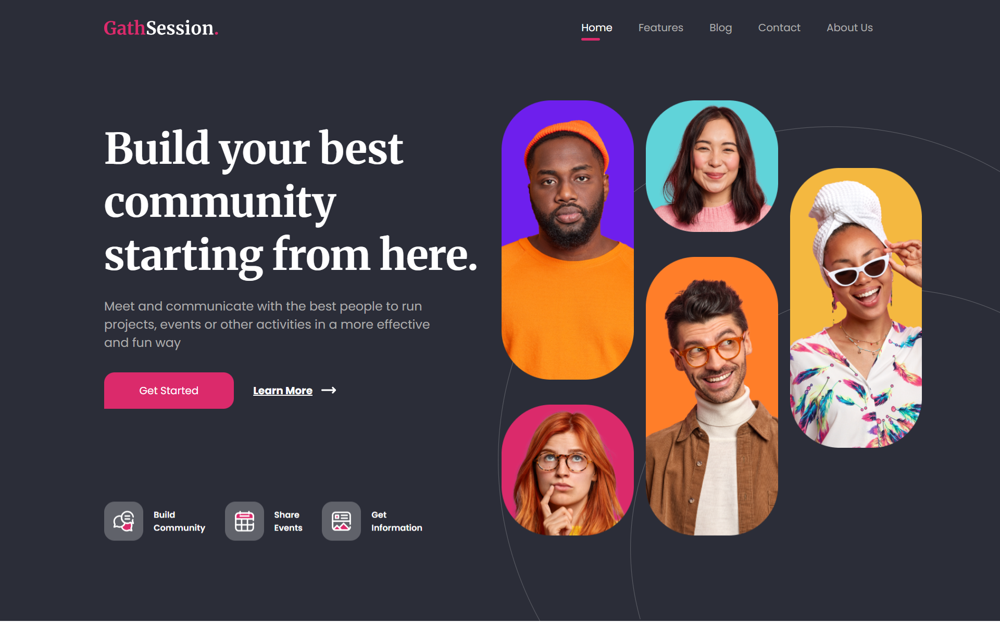

# 💬 GathSession – Online Forum Landing Page

Modern landing page about a beauty and spa products store.  
Built using a modular architecture with **Vite**, **Sass (SCSS)**, and **modern JavaScript (ES Modules)**.

This project was developed as a frontend practice applying clean structure, scalable styling, and proper Git workflow management.

---

## 🚀 Live Demo

👉 **[View Live Project](https://cris100fire.github.io/gathsession-landing-page/)**

---

## 🎥 Video Demo

📺 **[Watch Video](https://youtu.be/iF8qK8TF23g)**

---

## 🛠️ Technologies Used

- 
- 
- 
- 
- 
- 
- 
- 

---

## ✨ Features

- Clean and modern UI design
- Modular project structure
- Scalable styling with Sass
- Optimized build process using Vite
- Clear separation between development and production environments
- Production-ready setup

---

## 📦 Installation & Use

- Clone the repository: `git clone` https://github.com/Cris100Fire/gatsession-landing-page.git
- Install dependencies: `npm run install`
- Run development server: `npm run dev`
- Build for production: `npm run build`
- Preview production build: `npm run preview`

---

## 📚 What I Learned

With this project, I reinforced and improved concepts from my previous work:

- Better project preparation before pushing to a repository
- Cleaner folder organization using Vite
- Improved Sass architecture and responsibility distribution
- More structured separation of layout and styling concerns
- Writing cleaner and more modular SCSS files
- Smoother Git workflow from local development to remote repository

This project focused more on refining structure and workflow rather than learning entirely new technologies.

---

## 📌 Responsiveness

This landing page is currently optimized for desktop screens (~1536px width).  
It was designed as a desktop-focused layout and is not intended for mobile devices at this stage.

---

## 🚀 Future Improvements

- Make the design fully responsive
- Add advanced animations
- Implement shopping cart functionality
- Improve accessibility (ARIA, contrast, semantic HTML)
- Enhance SEO optimization

---

## 🤝 Contributions

Contributions are welcome! If you find any problems or have any suggestions for improvement, please open an issue or submit a pull request!

---

## 👨‍💻 Author

Developed by **Cristopher Cienfuegos**

---

## 📄 License

This project is licensed under the MIT License.
